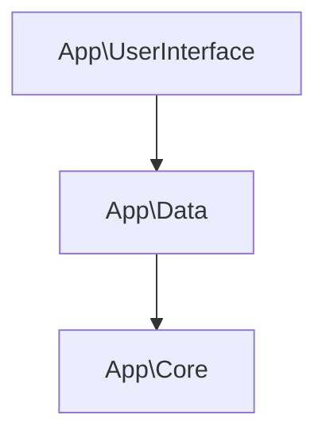
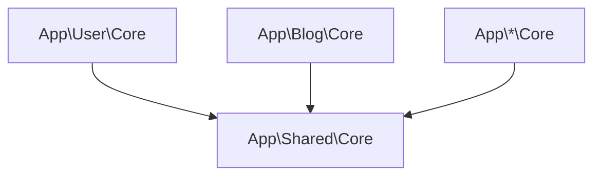

# PHPStan Namespace Constraints Rule

This repository contains the code for the namespace_constraints rule for PHPStan.

## Why?
In the most architectures you should not depend on everything.
With this rule you can ensure that a source namespace (RegEx Pattern) can only depend on code that lives in the target
namespaces.

## Installation
```bash
$ composer require --dev mintware-de/phpstan-namespace-constraints
```

## Configuration

Add this to your `phpstan.neon`

```neon
# phpstan.neon
includes:
    - vendor/mintware-de/phpstan-namespace-constraints/src/Rules/rules.neon

parameters:
    namespace_constraints:
        constraints:
            - from: 'App\\SourceNamespace(\\.*)?' # Everything inside this namespace has access to
              to: ['App\\SourceNamespace(\\.*)?'] # this namespace
```

## Examples

### Simple



```neon
# phpstan.neon
includes:
    - vendor/mintware-de/phpstan-namespace-constraints/src/Rules/rules.neon

parameters:
    namespace_constraints:
        constraints:
            - from: 'App\\Core(\\.*)?'
              to: ['App\\Core(\\.*)?']
            - from: 'App\\Data(\\.*)?'
              to: 
                - 'App\\Core(\\.*)?'
                - 'App\\Data(\\.*)?'
            - from: 'App\\UserInterface(\\.*)?'
              to: 
                - 'App\\Core(\\.*)?'
                - 'App\\Data(\\.*)?'
                - 'App\\UserInterface(\\.*)?'
```

### Advanced



```neon
# phpstan.neon
includes:
    - vendor/mintware-de/phpstan-namespace-constraints/src/Rules/rules.neon

parameters:
    namespace_constraints:
        constraints:
            # App\User Constraints
            - from: 'App\\User\\Core(\\.*)?'
              to: ['App\\User\\Core(\\.*)?']
            # App\\Blog\ Constraints
            - from: 'App\\Blog\\Core(\\.*)?'
              to: ['App\\Blog\\Core(\\.*)?']
            # App\*\Core -> App\Shared\Core
            - from: 'App\\(\w+)\\Core(\\.*)?'
              to: ['App\\Shared\\Core(\\.*)?']
```
